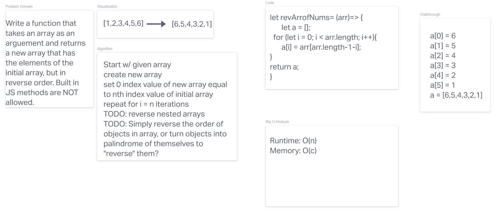

# Reverse an Array

The goal is to create a function that will take in array as an arguement and, without using any of the built in JavaScript methods, return an array with the elements in reversed order. 

## Whiteboard Process

## Approach and Efficiency 

For this approach, I wanted to make the code a simple as possible. To this end, I simply made an empty array, then set the individual elements at the i index of the new array equal to the elements at the nth index of the initial array. 