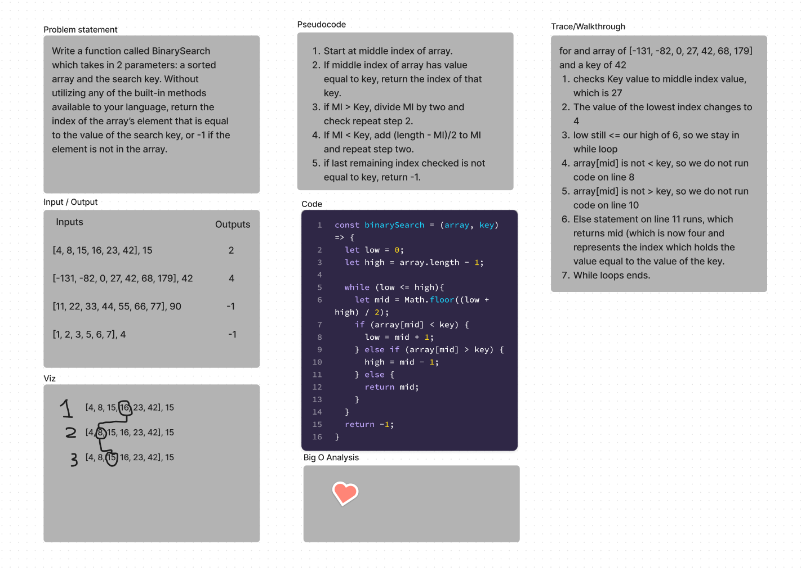

# Insert to Middle of an Array
Write a function called BinarySearch which takes in 2 parameters: a sorted array and the search key. Without utilizing any of the built-in methods available to your language, return the index of the array’s element that is equal to the value of the search key, or -1 if the element is not in the array. The Search algorthim used should be a binary search. 
## Whiteboard Process

## Approach & Efficiency
For this Challenge, I had to do some research into how binary search trees work. It appears similar to things I have done in the past, especially numerical approximation using the bisection method, and it works in a very similar fashion. The goal is to do a check to see if the middle index value matches the value on the key. If it does, then return the index. If not, then either divide the middle index by two if the key is less than that middle index, or multipling by the lowest index we care about (which changes) and the highest index we care about (which also changes). 

### Collaborated with Luis Sandoval. 