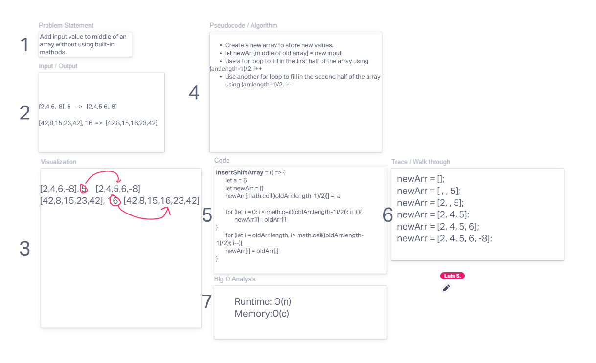

# Insert to Middle of an Array
Write a function called insertShiftArray which takes in an array and a value to be added. Without utilizing any of the built-in methods available to your language, return an array with the new value added at the middle index.

## Whiteboard Process

## Approach & Efficiency
For this challenge, I first made a new array which was empty, and calculated the center index of the original array (rounded up). From there, the problem was straightforward, with the first half of the new array being identical to the old array, the center index of the new array being the new input value, and the second half of the new array being equal to the second half of the old array. A separate for loop was used for the first half of the new array, with i incrementing up from zero to just less than the center of the new array. The center index of the new array was simply set equal to the input given, and the last half of the new array also used a for loop. But this time I started at the end of the array, setting the last index of the new array equal to that of the the old array, the second index of new array equal to the second of the old array, and so on, until the center of the new array had been reached. 