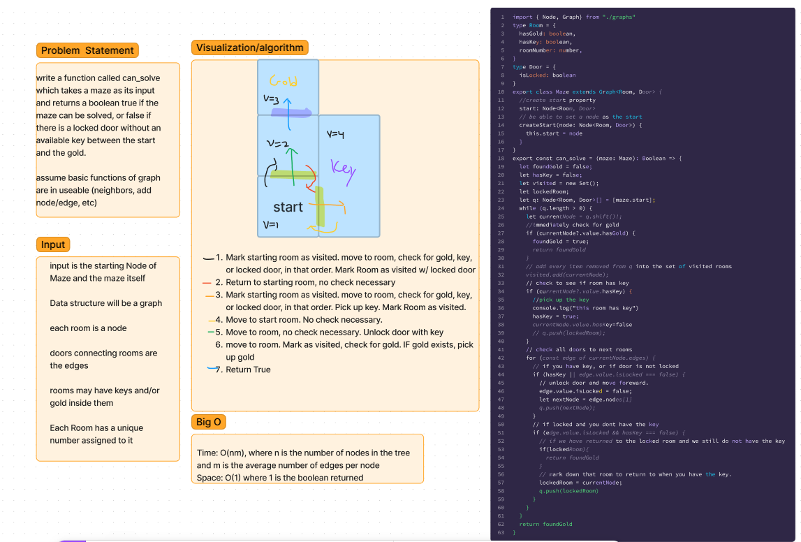

## CC 38 Maze Navigation
- Create a function which will take in a maze as the arguement and return a boolean which will read true if the maze can be successfully navigated or false if it cannot be navigated. 

### Whiteboard

## Business Trip Calculation
- Createa function which will calculate the total cost of a business trip itenerary, as well as determine if the trip is even possible with direct flights. 

### Whiteboard 

## Breadth First Traversal Of a Tree
- The goal is to take a node as an arguement, and then return an array with all of the values of the nodes in the graph
#### Note
- The breadth first traversal method as given here will not work if there are identical nodes in the tree. 
### Testing
- type npm test into console and see the tests run
