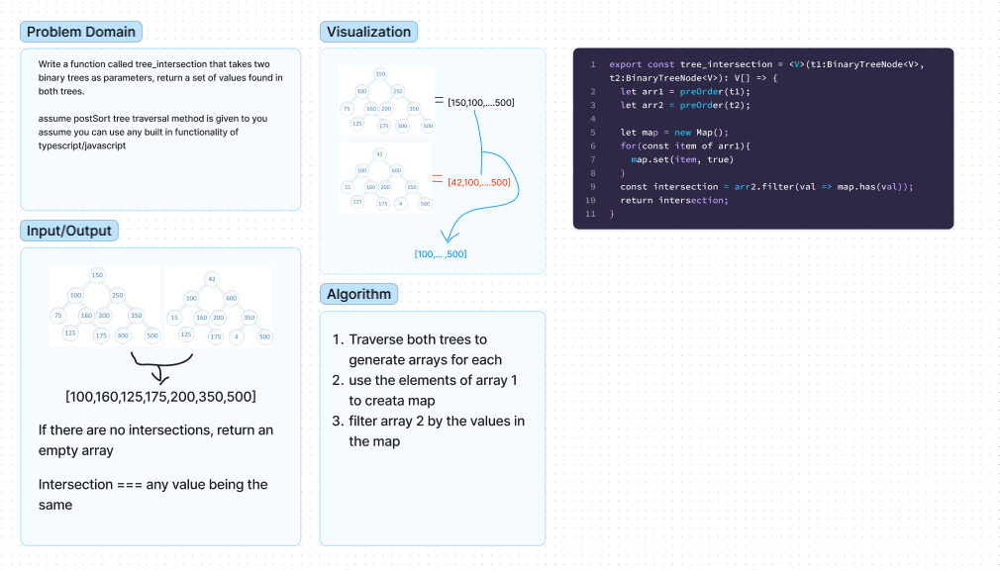
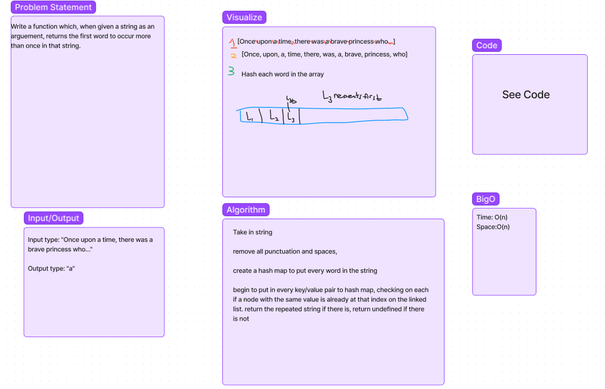

## Challenge 32
- Write a function called tree_intersection that takes two binary trees as parameters, return a set of values found in both trees.

- assume you will need to write your own way to traverse the trees
- assume you can use any built in functionality of typescript/javascript

## Challenge 31
- Write a function called repeated word that finds the first word to occur more than once in a string

## Challenge 30
- Implment a hashtable Class with the following methods:
1. Set(key, value) => void
    - should hash the key, set the key/val pair in the table, handling collisions as needed.
    - If a key already exists, replace its value from the value arguement given to this method. 
2. Get(key) => value associated with key in the table.
3. Has(key) => boolean indicating if key exists in table already
4. keys => collection of keys
5. hash(key)=> index in collection for that key. 

## Testing
1. Setting a key/value to your hashtable results in the value being in the data structure
2. Retrieving based on a key returns the value stored
3. Successfully returns null for a key that does not exist in the hashtable
4. Successfully returns a list of all unique keys that exist in the hashtable
5. Successfully handle a collision within the hashtable
6. Successfully retrieve a value from a bucket within the hashtable that has a collision
7. Successfully hash a key to an in-range value
8. preOrder should return an array of values of the tree in preOrder sequence, and Empty trees return an empty array
9. tree_intersection successfully returns the intersections of two trees
10. tree_intersection returns an empty array when the two trees compared have no intersections. 

