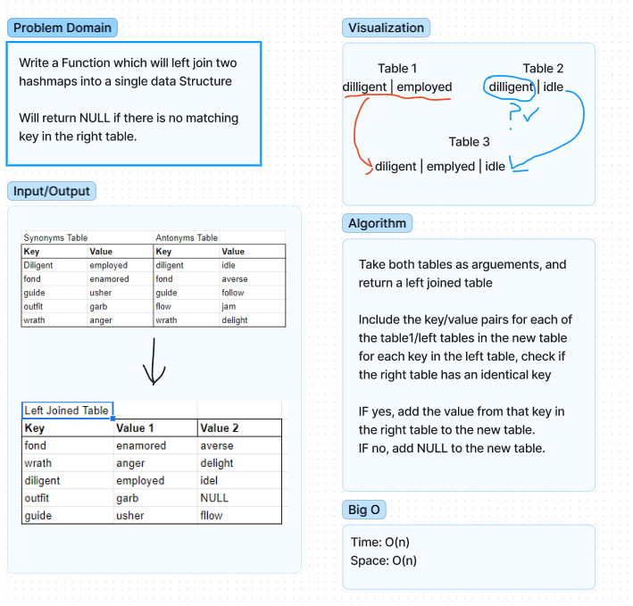

# Hashmap LEFT JOIN
- The purpose of this is to create my own left join function. 
- A left join function is meant to return all rows from the left table, and rows with a matching key from the right table. 
- If a key from the right table does not match the key from the left table, it should return NULL

## Approach & Efficiency
- I first created a varible called newData which is an array. 
- We will be pushing into this array all the results from the function leftJoin
- For each key value pair in the left table, we are checking to see if the right table has a matching key.
- If there is a matching key, then a new array is pushed into the newData array containing the key and the value from both tables.
- If there is no matching key in the right table, then a new array is pushed into the newData array containing the key, the value from the left table, and null.

## Solution

