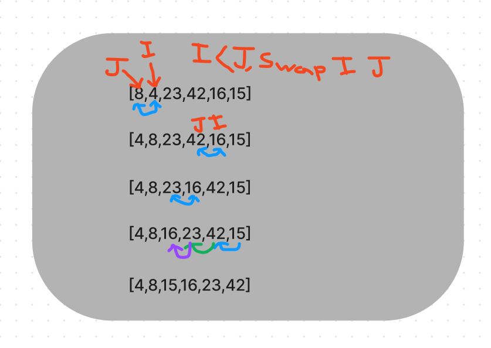

## Code Challenge 26

### Sort 
  - Write an algorithm to sort the given array ```[8,4,23,42,16,15]```
  - verify proper implmentation by typing ```npm run test``` in the console. 
### Visual 

### Insertion Sort
- Goes through every element in the array, keeping track of 2 variables, i and j. 
- i is one index ahead of j.
- if i is greater than j, then i and j swap places. 
- Once the swap occurs, the process begins again from the start of the array and repeats, until it can no longer find any instances of i > j. 