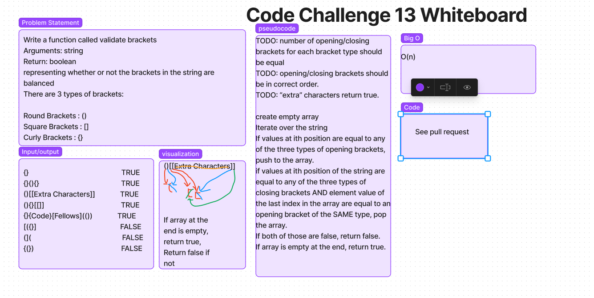

# Challenge 13 Summary
- Write a function which takes a string as an argument and checks it to see if there are any additional/missing brackets. Returns False if there are, True if there are not. 

## Whiteboard Process

## Approach & Efficiency
- create empty array
- Iterate over the string
- If values at ith position are equal to any of the three types of opening brackets, push to the array. 
- if values at ith position of the string are equal to any of the three types of closing brackets AND element value of the last index in the array are equal to an opening bracket of the SAME type, pop the array. 
- If both of those are false, return false.
- If array is empty at the end, return true.

## Solution
- Type in the string you want to use as the arguement. 
- Tests can be run using npm test. 