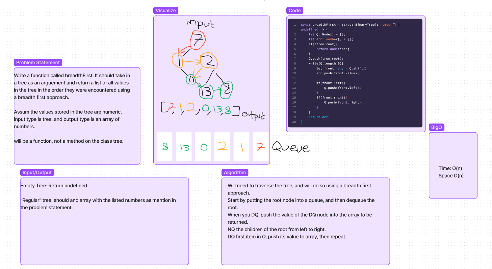

# Trees
- look [here](https://canvas.instructure.com/courses/4898196/discussion_topics/15038341) for more information about trees.

## Challenge
Write a function called breadth first
Arguments: tree
Return: list of all values in the tree, in the order they were encountered.

## Approach & Efficiency
- For this function, the root node is pushed into a queue, and then dequeued. Upon dequeueing, the value of the node is pushed to the array which will be returned, and the children of the root are enqueued to go through the same process. 
- Space: O(n)
- Time: O(n)

## API
- New function breadthFirst takes in a tree, accesses the root node through the root property on the tree, and then goes through the entirety of the tree, saving each of the values of the tree into an array which is returned once every node has been dequeued. 

## Whiteboard

